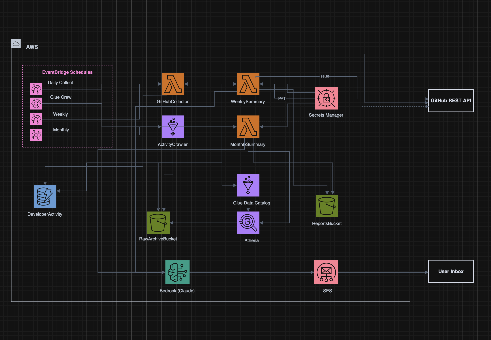

# github-logs

Collects your commit/issue/repo activity daily, stores normalized records
in DynamoDB, and uses Amazon Bedrock to generate a structured weekly
engineering report delivered by email. A separate monthly retrospective
runs Athena queries over a partitioned S3 data lake for longer-horizon
analytics. Optionally creates GitHub issues for next-step items that the
LLM judges worth tracking.



## Stack

| Layer | Service |
|---|---|
| Triggers | EventBridge |
| Compute | Lambda (Python 3.12, arm64) |
| Operational store | DynamoDB |
| Data lake | S3 (Hive-partitioned) |
| Schema discovery | Glue Crawler + Glue Data Catalog |
| Analytics | Athena |
| LLM | Bedrock (Claude Haiku) |
| Email | SES (HTML + plain text, multipart with inline assets) |
| Auth | Secrets Manager |
| IaC | AWS SAM |

## Repo layout

```
src/
  collectors/      GitHub fetch + normalization
  storage/         DynamoDB, S3, Athena access
  summaries/       Prompt builders, Bedrock client, weekly + monthly orchestrators
  notifications/   Jinja2 templates + SES sender (with inline image attachment)
  integrations/    GitHub write client (issue creation)
  common/          Config, logger, date helpers
lambdas/           Lambda entry points
infrastructure/    SAM template + parameters
scripts/           One-shot utilities (backfill, previews, issue cleanup)
sample_data/       Fixture JSON for prompt iteration
```

## Local setup

```sh
python3.12 -m venv .venv
source .venv/bin/activate
pip install -r requirements.txt -r requirements-dev.txt
cp infrastructure/parameters.example.json infrastructure/parameters.json
# fill in your values; parameters.json is gitignored
```

## Deploy

```sh
# Prereqs:
# - AWS CLI configured
# - SAM CLI installed
# - GitHub PAT stored in Secrets Manager
# - Bedrock inference profile granted in your region
# - SES sender email address verified in the SES console (one-time)

make deploy
```

After the first deploy, click the SES verification link AWS sends to your
sender address (if you haven't already verified it manually).

## Configuration

`infrastructure/parameters.json`:

| Key | Meaning |
|---|---|
| `GitHubUsername` | Your GitHub login |
| `GitHubSecretArn` | ARN of the Secrets Manager secret holding the PAT |
| `NotificationEmail` | Recipient (SES To: address) |
| `SenderEmail` | Sender (SES From: address; must be verified in SES) |
| `BedrockModelId` | Cross-region inference profile id |
| `CreateIssues` | `"true"` to open GitHub issues for actionable next-step items, `"false"` to disable |
| `PrivateReposOnly` | `"true"` (recommended) to restrict issue creation to private repos |
| `SkipIssueRepos` | Comma-separated `owner/repo` list to skip during issue creation |
| `Region` | AWS region for the stack |

## Issue creation

When `CreateIssues=true`, after each weekly or monthly run the LLM marks
a curated subset of next-step items as `actionable_issues` and the
integration creates one GitHub issue per item, labeled `github-logs/auto`,
idempotent on title. Skips duplicates and (by default) skips public repos.
